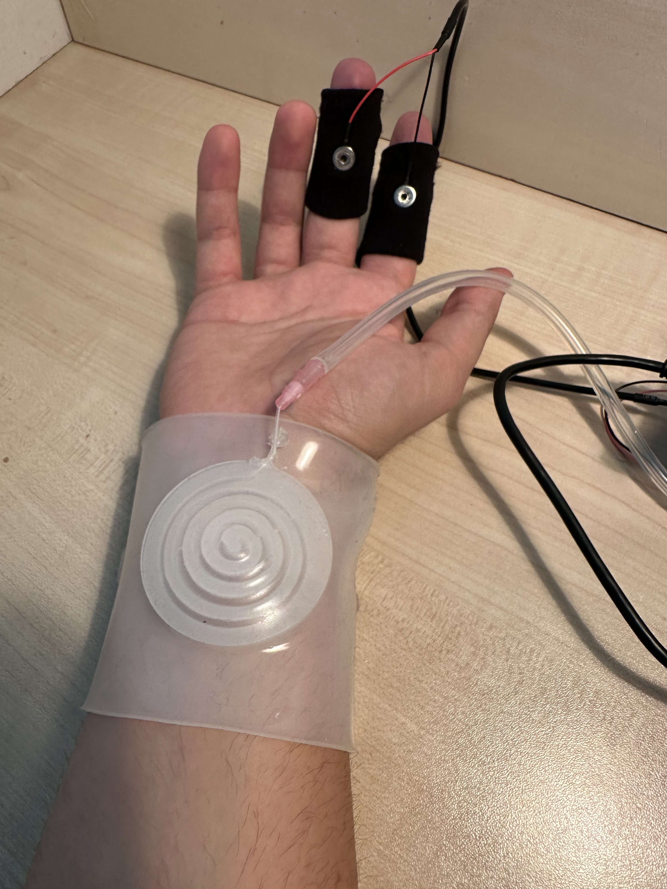

# GSR touch detector

This prototype consist in a soft-robotic interface that inflates to evoke a spiral “goosebumps” effect while sensing **autonomic touch responses** via **GSR** (electrodermal activity).  
Goal: **detect touch** and related arousal from the nervous system using GSR, and actuate pneumatic feedback.

### Hardware notes
- Use the Fritzing sources in `electronics/` for connections.  
- A micropump is driven by a transistor with a flyback diode. Power decoupling on the 5 V rail.  
- This device uses the GSR Grove Sensor - by Seed Studio.

## The actuator: stl files, use these as mold for silicone casting (ECOFLEX 00-30)
1. spiralmold.stl: A silicone mold that creates a **spiral channel**. When inflated, the pad expands laterally with a visible spiral effect.  
2. siliconebraceletmold: A bracelet with a hole where io can insert and mold with a thin layer of silicone teh spiral actuator.

---

## Quick start - Connect the pump, the electrodes and flash the firmware

Folder: `firmware/`  
- Builds for **ESP32** (Arduino IDE).  
- Reads GSR, applies real-time filtering and touch detection, controls the pump, and can stream or log data.

---

## License
Add a license file (e.g., MIT for code; consider a permissive license or CC-BY for CAD/STL).

## Citation
If you build on this work in publications or demos, please cite related work in your profile and link back to this repository.
